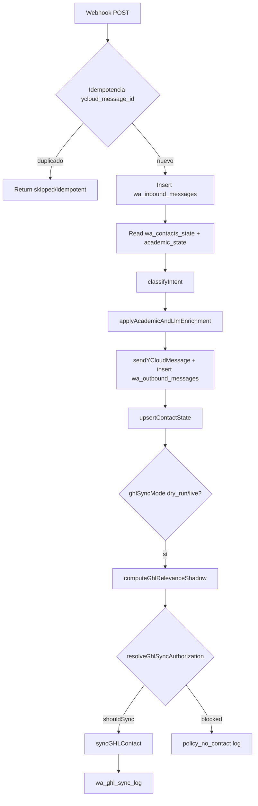

# Gap Analysis — Fase 1 Migración Eva WA (Determinístico)

**Fecha:** 2026-07-04  
**Alcance:** Portar reglas de negocio del Prompt Maestro v2.1 al motor actual (`ycloud-wa-inbound.js` + `academic-engine`).  
**Fuera de alcance Fase 1:** Fable 5, RAG, clasificador LLM (Paso 0 spec v4.1), motor de síntesis §5 spec.  
**Estado:** APROBADO 2026-07-04 — implementación en curso (ítem 0 ✅).

---

## Orden de implementación (aprobado)

| # | Ítem | Flag | Estado |
|---|---|---|---|
| 0 | Fix D4 catálogo SoT + matriz demanda §11 (5 fantasmas + Medicina) | — (always-on) | **✅ Done** — `tests/run-phase-fase1-item0-catalog-sot.mjs` 30/30 |
| 1 | Verificar idempotencia ENG-0B (replay, cero side effects) | always-on | **✅ Done** — insert-first + `tests/run-phase-fase1-item1-idempotency.mjs` 23/23 |
| 2 | OPT-OUT / NO_CONTACT (D22) | `FF_FSM`? → `FF_OPT_OUT` implícito en ítem 2 | Pendiente |
| 3 | FSM lite (D1) | `FF_FSM` | Pendiente |
| 4 | notOfferedResolver pipeline §11.1 completo | `FF_NOT_OFFERED` | Pendiente |
| 5 | Fallbacks §12 + memoria (D23) | parte de FSM/fallbacks | Pendiente |
| 6 | EscalationPayload §13 + dedupe task | `FF_ESCALATION_V2` | Pendiente |

**Nota:** Ítems 2–6 detrás de feature flags env. Ítems 0–1 sin flag (guardrail + idempotencia always-on).

---

## Resumen ejecutivo

| Ítem Fase 1 | Estado actual | Gap principal |
|---|---|---|
| 0. Catálogo §4.1 (D4) | **✅ Corregido** — `catalog-sot.js` | — |
| 1. Idempotencia E1 | **✅ Verificado** — `claimInboundMessageForProcessing` insert-first | — |
| 2. OPT-OUT / NO_CONTACT | **Ausente** | Matcher D22 + `no_contact` + tag `wa_no_contact` |
| 3. FSM LITE | **Ausente** | Columnas aditivas + `fsm_state`; `wa_stage` convive |
| 4. Matriz §11 NO OFERTADAS | **Parcial** — demanda esperada en ítem 0; pipeline §11.1 ítem 4 | `FF_NOT_OFFERED` |
| 5. Fallbacks §12 | **Parcial** | `fallback_count`, niveles 1–3, D23 |
| 6. Escalación §13 v2 | **Parcial** | `EscalationPayload` + dedupe task/día |

**Suite de tests §16 aplicable a Fase 1:** T01–T08, T11–T17, T20–T24, T27 + replay webhook duplicado.  
**Tests existentes relacionados:** `tests/run-phase-eng-0b-idempotency.mjs` (T15 parcial), `tests/run-phase-eng-0c-classify-intent-replay.mjs` (regresión intents, no maestro).

---

## (a) Mapa intent actual → intentId Maestro §5

El handler usa **snake_case español** en `classifyIntent()` → `buildIntentDecision()`.  
El maestro usa **camelCase inglés** en §5.1 (admisiones) + §5.2 (comerciales) + §5.3 (operativas).

### Tabla principal — intents WA actuales (20)

| Intent actual (`ycloud-wa-inbound.js`) | intentId Maestro §5 | Lead state Maestro | Notas de gap |
|---|---|---|---|
| `sin_texto` | *(operativa)* `block_duplicate_side_effects` / desvío D08 | — | OK operativo; no mapea a intent de dominio |
| `duda_test` | `vocational_test` (soporte) + desvío test.trabado | `test_needed` / escalación | Task genérica; maestro pide tag `wa_test_issue` |
| `post_test` | `vocational_test` (post) | `test_needed` | Maestro: **prohibido** reofrecer test (T28) — parcialmente cubierto en academic-engine |
| `humano` | `human_advisor` | `human_requested` | Escalación sin `EscalationPayload.reason=human_requested` |
| `carrera_no_ofertada` | `career_specific` → pipeline §11 | `career_not_offered` | **Solo Medicina** (`matchesCarreraNoOfertadaMedicina`); no pipeline completo |
| `revalidacion_estudios` | `revalidation` / `equivalence` | `escalated_to_human` | Task existe; reason enum `revalidation_case` ausente |
| `niveles_no_principales` | *(no ofertada §11.1 posgrados/prepa)* | `career_not_offered` | Respuesta genérica; no matriz §11 |
| `ubicacion_campus` | `campus_info` | `general_interest` | OK aproximado |
| `rvoe_reconocimiento` | `rvoe` | `career_interest` | Sin escalación `rvoe_sensitive` cuando falta dato (T19) |
| `objecion_precio` | `lead_objects_price` / objeción §7 | `objection_price` | Matriz objeciones §7 no portada en Fase 1 |
| `promociones_descuentos` | `promotions` | `price_interest` | OK aproximado |
| `beca` | `scholarships` | `scholarship_interest` | Academic-engine enriquece; tags maestro `wa_scholarship_interest` vs `wa_interes_beca` |
| `no_se_que_estudiar` | `undecided` | `undecided` / `test_needed` | OK; ver T18/T28 post_test |
| `carreras_online` | `modality_specific` | `modality_interest` | Placeholder EVA_CARRERAS_ONLINE; academic-engine puede enriquecer |
| `carreras_disponibles` | `list_careers` | `general_interest` | **Lista hardcodeada con carreras fantasma** (Arquitectura, Contaduría, Criminología, Educación, Diseño) — no están en SoT §4.1 |
| `carrera_interes` | `career_specific` | `career_interest` | Generic placeholder; academic-engine enriquece si `ACADEMIC_ENGINE_ENABLED=true` |
| `agradecimiento` | `thanks` | — | OK |
| `despedida` | `farewell` | — | OK |
| `ambiguo` | `general_info` / fallback §12.1 | `general_interest` | Menú distinto al maestro §12.1 (4 opciones con emojis) |
| `fallback_inteligente` | `smart_fallback` | `low_confidence` | Sin `fallback_count`; no niveles 2/3 |

### Intents Maestro §5 **sin equivalente directo** en classifier WA

| intentId Maestro | Cobertura actual | Acción Fase 1 |
|---|---|---|
| `greeting` | Parcial vía `matchesVagueGreeting` → `ambiguo` o `fallback_inteligente` | Unificar saludo T01 |
| `cost`, `duration`, `documents`, `enrollment_fee`, … | Solo vía **academic-engine** si enriquecimiento activo | Extender memoria §12.7 + follow-ups T03–T05, T27 |
| `schedule_appointment`, `campus_visit` | Parcial (`humano`, `ubicacion_campus`) | Escalación `appointment` en ítem 6 |
| `compare_careers` | No | T25 — Fase 1 si hay memoria multi-carrera |
| `lead_no_call` (T13) | **Ausente** | Nuevo matcher + tag `wa_no_call` |
| `lead_not_interested` | Parcial (opt-out D22) | Ítem 2 |
| `lead_wants_enroll`, `lead_urgent`, `payment_intent` | Parcial en frases sueltas → `humano` | EscalationPayload T12 |
| Intents operativos §5.3 | Implícitos en GHL sync | Formalizar en EscalationPayload + side effects |

### Intents academic-engine (`detectAcademicIntent`) — capa secundaria

| Academic intent | Maestro §5 | Cuándo corre |
|---|---|---|
| `greeting` | `greeting` | Solo si WA intent enriquecible |
| `career_list` | `list_careers` | `carreras_disponibles`, `ambiguo`, etc. |
| `career_detail` | `career_specific`, `cost`, `duration` | Con entidad carrera |
| `scholarship` | `scholarships` | `beca` + promedio |
| `modality_filter` | `modality_specific` | `carreras_online` |
| `fallback` | `smart_fallback` | Default |

**Regla de convivencia Fase 1:** mantener intents WA como primary key; maestro `intentId` como campo derivado (`maestro_intent_id`) solo cuando `FF_*` activos, para no romper suites 7G.x.

---

## (b) Persistencia de sesión / estado hoy

### Tablas InsForge en uso

| Tabla | Rol | Campos relevantes |
|---|---|---|
| `wa_inbound_messages` | Idempotencia E1 (ENG-0B) | `ycloud_message_id` UNIQUE (partial index), `raw_payload`, `status` |
| `wa_outbound_messages` | Respuestas enviadas | `inbound_message_id`, `response_text`, `status` |
| `wa_contacts_state` | Estado por teléfono | `normalized_phone` (UK), `wa_stage`, `wa_last_intent`, `wa_needs_human`, `wa_summary`, `ghl_contact_id`, `academic_state` (JSONB) |
| `wa_ghl_sync_log` | Auditoría CRM | `action`, `payload` (tags/note/task), `sync_mode` |
| `wa_errors` | Warnings / errores | — |

**No existe:** tabla `sessions` de spec v4.1 §2 (FSM enriquecida con `current_state`, `fallback_count`, `closed_by_agent`).

### RPC academic_state (ENG-0A-bis)

- `insforge/sql/wa_contacts_state_academic_state_rpc.sql` — `get_contact_academic_state` / `patch_contact_academic_state`
- Activación runtime: `ACADEMIC_STATE_REST_DIRECT=true` (env)

### `academic_state` persistido hoy (`stateManager.js`)

```txt
current_intent, current_career, current_area, current_modality, last_career, last_question
```

### `academic_state` requerido por Maestro §12.7 (gap)

```txt
currentCareer, lastMentionedCareer, currentModality, areaOfInterest, averageGrade,
scholarshipInterest, humanIntent, undecidedFlag, askedDocuments, askedCosts,
askedDuration, askedRvoe, notOfferedCareerRequested, lastObjection, lastFallbackLevel
```

Además FSM / fallbacks:

| Campo | Maestro / Spec | En código |
|---|---|---|
| `fallback_count` | §12, spec E2 | **Ausente** |
| `closed_by_agent` | Spec E2 | **Ausente** |
| FSM `current_state` | §10 + spec: SALUDO_INICIAL \| CONSULTA \| HUMANO \| NO_CONTACT | **Ausente** — se usa `wa_stage` libre (ej. `carrera_interes`, `orientacion`) |
| `no_contact` flag | §10, D22 | **Ausente** |
| Lead states (`career_interest`, `price_interest`, …) | §10 | **No modelados** — inferibles desde `wa_stage` parcialmente |

### Propuesta de persistencia Fase 1 (sin nueva dependencia)

**Opción recomendada:** extender `wa_contacts_state` + JSON `academic_state`:

- Columnas nuevas (SQL migration): `wa_fsm_state VARCHAR(30)`, `closed_by_agent BOOLEAN DEFAULT FALSE`, `no_contact BOOLEAN DEFAULT FALSE`
- JSON: `fallback_count`, campos §12.7 faltantes
- **Alternativa descartada por ahora:** tabla `sessions` separada (spec v4.1) — duplicaría fuente de verdad con `wa_contacts_state`

→ Ver **DECISIONES PENDIENTES §1**.

---

## (c) Side effects GHL — dónde se disparan hoy



### Puntos de código

| Paso | Archivo | Función | Efectos |
|---|---|---|---|
| Idempotencia | `ycloud-wa-inbound.js` ~2686–2748 | `tryIdempotentEarlyReturn`, `handleInboundInsertUniqueRace` | Abort antes de insert; **cero** outbound/GHL |
| Tags | `ycloud-wa-inbound.js` ~930–985 | `getIntentTags`, `INTENT_TAG_MAP` | Taxonomía **legacy** (`wa_interes_*`) ≠ maestro `wa_*` §14 |
| Note | `ycloud-wa-inbound.js` ~1080+ | `buildGHLNoteBody` | 1 note/turno; sin dedupe diario |
| Task | `ycloud-wa-inbound.js` ~1017+, `sync-ghl-contact.js` | `getTaskTitle`, `shouldCreateTaskDryRun`, live task create | Sin dedupe `(contactId, reason, fecha)` |
| Contact create/update | `sync-ghl-contact.js` | `syncGHLContact`, `syncGHLContactDryRun` | Upsert por phone; guarda `ghl_contact_id` |
| Gate (shadow) | `ghl-relevance-gate.js` | `evaluateGhlRelevance` | Decide sync; **no conoce** opt-out / no_contact |
| Allowlist live | `ycloud-wa-inbound.js` | `resolveGhlLiveAllowlist` | Bloquea live fuera de lista |

### Side effects Maestro §14 **ausentes**

- `wa_market_signal_career_demand` + note con `requestedCareerRaw` (§11)
- `wa_no_contact` (D22)
- `wa_low_confidence` (fallback nivel 3)
- Dedupe task por día
- Dedupe note textual mismo día
- EscalationPayload completo (§13.2) → task title/tag/note/priority

---

## (d) Archivos a tocar (Fase 1 post-aprobación)

### Handler y orquestación

| Archivo | Cambio previsto |
|---|---|
| `insforge/functions/ycloud-wa-inbound.js` | FF env, opt-out matcher, FSM hooks, integrar not-offered/escalation/fallbacks, gate proactivos |
| `insforge/functions/lib/sync-ghl-contact.js` | EscalationPayload, task dedupe, tags maestro §14 |
| `insforge/functions/lib/ghl-relevance-gate.js` | Respetar `no_contact`; señales escalación v2 |

### Academic engine

| Archivo | Cambio previsto |
|---|---|
| `insforge/functions/lib/academic-engine/stateManager.js` | Campos §12.7 + `fallback_count` |
| `insforge/functions/lib/academic-engine/entityExtractor.js` | Typo/parecida (T07); `requestedCareerRaw` |
| `insforge/functions/lib/academic-engine/intentEngine.js` | Follow-ups costo/duración con memoria |
| `insforge/functions/lib/academic-engine/responseBuilder.js` | Respuestas fallback 12.1–12.4 |
| `insforge/functions/lib/academic-engine/adapter.js` | Gating por FF; not-offered no enriquecer |
| **Nuevo** `insforge/functions/lib/academic-engine/notOfferedResolver.js` | Pipeline §11.1 + matriz §11 precargada + plantilla 8 pasos |
| **Nuevo** `insforge/functions/lib/escalation-payload.js` | Enum 15 reasons §13.2 + builders |

### FSM

| Archivo | Cambio previsto |
|---|---|
| **Nuevo** `insforge/functions/lib/fsm-lite.js` | Transiciones SALUDO_INICIAL \| CONSULTA \| HUMANO \| NO_CONTACT + E2 |

### SQL / migraciones

| Archivo | Cambio previsto |
|---|---|
| **Nuevo** `insforge/sql/wa_contacts_state_fsm_fase1.sql` | `wa_fsm_state`, `closed_by_agent`, `no_contact` |
| `insforge/sql/wa_contacts_state_academic_state_rpc.sql` | Ampliar patch si RPC valida schema estricto |

### Tests

| Archivo | Cambio previsto |
|---|---|
| **Nuevo** `tests/run-phase-fase1-maestro.mjs` | T01–T08, T11–T17, T20–T24, T27 + replay duplicado |
| **Nuevo** `tests/payloads/phase-fase1-maestro.json` | Fixtures |
| `tests/run-phase-eng-0b-idempotency.mjs` | Integrar bajo suite Fase 1 o re-export |
| `insforge/functions/lib/test/mock-insforge-client.js` | Columnas FSM + dedupe tasks |

### Documentación (esta fase)

| Archivo | Estado |
|---|---|
| `docs/migracion/gap_fase1.md` | **Este documento** |

**No tocar en Fase 1:** `motor_sintesis_fable5_v1_2.md`, RAG, Paso 0 LLM spec §5, `prompts/eva-wa-principal.md` (salvo referencia).

---

## Detalle por ítem de alcance Fase 1

### 1. Idempotencia E1

**Hoy (ENG-0B):**
- Lookup `wa_inbound_messages` por `ycloud_message_id` **antes** de procesar (~3082)
- Insert con race handler en unique violation
- Response: `{ skipped: true, idempotent: true, reason: "duplicate_ycloud_message_id" }`
- Índice: `insforge/sql/wa_inbound_messages_idempotency.sql`
- Test: `tests/run-phase-eng-0b-idempotency.mjs`

**Gap vs requisito:**
- No hay `FF_IDEMPOTENCY` — comportamiento **siempre ON**
- Si falta `ycloud_message_id`, continúa sin dedupe (warning log) — maestro exige clave obligatoria
- Verificar T15: segunda invocación debe tener **cero** inserts en outbound, contacts, ghl_sync (mock suite ya valida parcialmente)

**Implementación propuesta:** env `FF_IDEMPOTENCY=true` activa path actual; `false` desactiva early return (rollback). Default **`false`** hasta validación Fase 1, luego flip en prod.

---

### 2. OPT-OUT / NO_CONTACT (D22, T14)

**Hoy:** sin matcher. `policy_no_contact` en GHL es **política de sync**, no opt-out del lead.

**Requerido:**
- Frases: "ya no me escriban", "baja", "no contactar", etc. (D22)
- Estado persistente `no_contact` + tag `wa_no_contact`
- Bloquear mensajes **proactivos** (outbound iniciado por sistema — hoy no hay cron proactivo en handler; preparar flag + gate)
- Side effect permitido: solo registro opt-out (D22 columna "Bloquear SE")

---

### 3. FSM LITE (spec E2)

**Hoy:** `wa_stage` = string operativo por intent (20+ valores distintos).

**Requerido:**

| Estado FSM | Entrada | Salida típica |
|---|---|---|
| `SALUDO_INICIAL` | Primer contacto | `CONSULTA` |
| `CONSULTA` | Intents informativos | `HUMANO` si escalación |
| `HUMANO` | Escalación §13 | Permanece; `closed_by_agent=false` al entrar |
| `NO_CONTACT` | Opt-out D22 | Terminal proactivos |

**E2:** reset TTL 24h solo si `HUMANO` + `closed_by_agent=true`. **No implementar cron en Fase 1** — solo reglas de escritura; cron documentado como Fase 2 ops.

---

### 4. Matriz §11 NO OFERTADAS (T06, T07, T08)

**Hoy:**
- `matchesCarreraNoOfertadaMedicina` — keywords medicina/médico/doctor
- Respuesta fija `EVA_MEDICINA_NO_OFERTADA_RESPONSE` — **2 alternativas implícitas**, no plantilla 8 pasos
- Tag `wa_carrera_no_ofertada` + extra `wa_salud` — **falta** `wa_market_signal_career_demand`, note `requestedCareerRaw`

**Catálogo SoT real (`source-of-truth.js`):** 9 `programa_base` — Derecho, Psicología, Enfermería, Nutrición, Ing. Sistemas, Administración (×2 modalidades), Ventas y Mercadotecnia (×2), Negocios Internacionales, Gastronomía.

**Matriz maestro §11 precargada:** Medicina → Enfermería, Nutrición, Psicología; Arquitectura/Ing.* → Ing. Sistemas; etc.

**Gap crítico:** `carreras_disponibles` y `EVA_CAREER_NAMES` listan **Arquitectura, Contaduría, Criminología, Educación, Diseño** — **no existen en SoT** → violación guardrail §15.

**Implementación:** módulo `notOfferedResolver.js` + `FF_NOT_OFFERED`; respuesta determinística con **nombres exactos** del catálogo.

---

### 5. Fallbacks §12 (T03, T04, T20, T21, T16)

**Hoy:**
- `ambiguo` → `EVA_AMBIGUO_MENU`
- `fallback_inteligente` → texto genérico
- `shouldShowAmbiguoMenu` usa historial `wa_stage`/`wa_last_intent`
- Academic-engine resuelve costo **si** `current_career` en memoria **y** engine enabled

**Gap:**
- Sin `fallback_count` ni niveles 1→2→3
- Nivel 3 → HUMANO + `wa_low_confidence` (T21)
- T03/T04/T27: follow-up costo sin/con memoria
- Fuera de dominio T16: no diferenciado de fallback genérico

---

### 6. Escalación §13 + side effects §14 (T11, T12, T22)

**Hoy:**
- `needsHuman` + `createTask` en matrix intents
- `EVA_INTENT_TASK_TITLES` — 7 títulos fijos
- `enrichDecisionWithOperational` — priority/escalation_required
- **Sin** enum `reason` §13.2 (15 valores)
- **Sin** dedupe task `(contactId, reason, día)`

**Mapeo parcial intent → reason:**

| Intent actual | reason §13.2 propuesto |
|---|---|
| `humano` | `human_requested` |
| `post_test`, `duda_test` | *(custom)* / `low_confidence` |
| `revalidacion_estudios` | `revalidation_case` |
| `promociones_descuentos`, `beca` | `scholarship_special` / gate |
| `carrera_no_ofertada` + orientación | `career_not_offered_help` |
| *(nuevo)* inscripción explícita | `ready_to_enroll` |
| fallback nivel 3 | `low_confidence` |

---

## Cobertura tests §16 — Fase 1

| Test | Descripción | Cobertura actual | Prioridad Fase 1 |
|---|---|---|---|
| T01 | Saludo "hola" | Parcial | Alta |
| T02 | Info psicología | Academic-engine | Alta |
| T03 | Costo sin contexto | Parcial | Alta |
| T04 | Costo con memoria | Parcial (ENG-0A) | Alta |
| T05 | Follow-up modalidad | Parcial | Media |
| T06 | Medicina no ofertada | **✅ Ítem 0** — plantilla §11 + 3 alternativas Salud | — |
| T07 | Typo sicología | **Ausente** | Alta |
| T08 | Modalidad inválida enfermería online | **Ausente** | Alta |
| T11 | Humano | Parcial (task) | Alta |
| T12 | Inscripción urgente | Parcial | Alta |
| T13 | No llamadas | **Ausente** | Media |
| T14 | Opt-out | **Ausente** | **Crítica** |
| T15 | Replay idempotente | ENG-0B | **Crítica** |
| T16 | Fuera dominio | Parcial | Media |
| T17 | Hostilidad x3 | **Ausente** | Baja Fase 1 |
| T20 | "info" fallback 1 | Parcial (`ambiguo`) | Alta |
| T21 | Doble fallback → nivel 3 | **Ausente** | Alta |
| T22 | Multi-intent | **Ausente** | Media |
| T23 | Padre/madre | **Ausente** | Baja |
| T24 | Prompt interno D26 | **Ausente** | Media |
| T27 | Inscripción sin modalidad | Parcial | Alta |
| T09,T10,T18,T19,T25,T26,T28 | Fuera lista mínima Fase 1 | Variado | Opcional / stretch |

---

## DECISIONES — RESUELTAS (2026-07-04)

### D1 — FSM: extender `wa_contacts_state` ✅ RESUELTO

- **Decisión:** Opción A — columnas aditivas `fsm_state`, `closed_by_agent`, `fallback_count` (SQL ítem 3).
- **`wa_stage` no se modifica ni elimina** — convive para rollback.
- Migración con DEFAULT + backfill `wa_stage` → `fsm_state`:

| `wa_stage` (actual) | `fsm_state` (backfill) |
|---|---|
| `inicio`, `pendiente_texto`, `orientacion`, `ambiguo`, `cierre_positivo`, `despedida` | `SALUDO_INICIAL` |
| `carrera_interes`, `carreras_exploracion`, `carreras_online`, `ubicacion_consultada`, `rvoe_consultado`, `objecion_precio`, `promocion_interes`, `nivel_no_principal`, `revalidacion_interes`, `carrera_no_ofertada`, `test_recomendado` | `CONSULTA` |
| `asesor_requerido`, `soporte_test`, `post_test`, `beca_interes` | `HUMANO` |
| *(nuevo ítem 2)* `no_contact` | `NO_CONTACT` |
| *(default)* cualquier otro valor | `CONSULTA` |

---

### D2 — Idempotencia: always-on ✅ RESUELTO + VERIFICADO (ítem 1)

- **No** `FF_IDEMPOTENCY` — ENG-0B permanece always-on (apagarla = side effects duplicados).
- Fix: `claimInboundMessageForProcessing` — INSERT primero; unique violation → abort idempotente.
- Test: `tests/run-phase-fase1-item1-idempotency.mjs` — **23/23 PASS**; ENG-0B 4/4; ENG-0C 17/17.
- Auditoría V1/V2: [sección siguiente](#auditoría-idempotencia-eng-0b-ítem-1).

---

## Auditoría idempotencia ENG-0B (ítem 1)

### V1 — ¿Es atómica?

**Estado previo (ENG-0B original): NO del todo.**

| Aspecto | Implementación previa | Riesgo |
|---|---|---|
| Replay secuencial | `SELECT` en `tryIdempotentEarlyReturn` → abort antes del INSERT | OK para replay |
| Carrera concurrente | Dos requests pasaban el `SELECT` vacío → ambos llegaban al INSERT | Mitigado por unique index + handler de carrera **después** del INSERT; side effects solo tras INSERT exitoso |
| Patrón | SELECT-then-INSERT | No cumple contrato insert-first del maestro §14 / spec E1 |

**Fix ítem 1:** `claimInboundMessageForProcessing()` — **INSERT es la primera escritura de negocio**. Si `23505` → `{skipped:true, idempotent:true, reason:"duplicate_ycloud_message_id"}` sin classifyIntent, outbound, GHL ni upsert contact.

Equivalente semántico a `INSERT … ON CONFLICT DO NOTHING` + abort si no se reclama la fila.

**Test concurrente:** `Promise.all` mismo `message_id` → 1 procesado + 1 idempotente; 1 inbound / 1 outbound / 1 ghl_log.

### V2 — ¿En qué punto corre?

**Orden post-fix:**

```txt
1. Parse JSON + validación firma YCloud
2. Filtros non_inbound / own_business (sin DB)
3. normalizePhoneMX (sin DB)
4. getClient()
5. ★ claimInboundMessageForProcessing (INSERT wa_inbound_messages) ★
   └─ duplicate → return idempotent (FIN)
6. logWarning phone / missing ycloud_message_id (solo si claimed)
7. read wa_contacts_state → classifyIntent → outbound → upsert → GHL
```

**Escrituras antes del claim (documentadas, sin mover en ítem 1):**

| Escritura | Cuándo | Impacto replay estándar |
|---|---|---|
| `wa_errors` firma YCloud | Header signature sin secret en mock | Ninguno si no hay header |
| Early return filtros | non_inbound, own_business | N/A |

**Movido después del claim:** warnings de teléfono y `missing_ycloud_message_id`.

**Conclusión V2:** Pipeline de negocio cumple insert-first; side effects estrictamente post-claim.

---

### D3 — Tags legacy + maestro §14 ✅ RESUELTO

Aditivo: flujos nuevos usan tags maestro; legacy se mantiene en sync existente hasta Fase 2.

| Tag legacy (deprecated Fase 2) | Tag maestro §14 (nuevo) | Notas |
|---|---|---|
| `wa_interes_carrera` | `wa_career_<slug>` | slug desde `programa_base` normalizado |
| `wa_interes_carreras` | — | listado; usar tags por carrera o `wa_career_not_offered` |
| `wa_interes_beca` | `wa_scholarship_interest` | |
| `wa_interes_promocion` | `wa_scholarship_interest` / promoción | asesor valida |
| `wa_interes_info` | — | fallback general |
| `wa_interes_test` | `wa_test_referred` | |
| `wa_requiere_asesor` | `wa_needs_human` | |
| `wa_carrera_no_ofertada` | `wa_career_not_offered` + `wa_market_signal_career_demand` | ítem 4 añade note |
| `wa_salud` (extra medicina) | `wa_career_not_offered` | retirar en Fase 2 |
| `wa_objecion_precio` | `wa_objection_price` | Fase 2 |
| `wa_post_test` | tag GHL origen `post_test` | no reofrecer test |
| `wa_duda_test` | `wa_test_issue` | Fase 2 |
| `wa_revalidacion` | `wa_revalidation` | Fase 2 |
| `wa_nivel_no_principal` | `wa_requested_invalid_level` | Fase 2 |
| `wa_ubicacion` | `wa_campus_<slug>` | Fase 2 |
| `wa_rvoe` | `wa_rvoe_escalation` si escala | Fase 2 |

---

### D4 — Catálogo hardcoded vs SoT ✅ RESUELTO (ítem 0)

- Fix **always-on**, sin flag — bug de guardrail activo.
- `insforge/functions/lib/academic-engine/catalog-sot.js` — única fuente derivada de `source-of-truth.js`.
- Eliminadas listas `EVA_CAREER_NAMES` y texto hardcodeado en `carreras_disponibles`.
- 5 fantasmas → `EXPECTED_NOT_OFFERED_DEMAND` (Arquitectura, Contaduría, Criminología, Educación, Diseño) + Medicina.
- Test: `tests/run-phase-fase1-item0-catalog-sot.mjs` — **30/30 PASS**.

---

### D5 — Academic-engine gating ✅ RESUELTO

- Handler mínimo para follow-ups (ej. costo con carrera en memoria) **sin** engine.
- Academic-engine enriquece cuando `ACADEMIC_ENGINE_ENABLED=true`.

---

### D6 — Alcance desvíos §8 ✅ RESUELTO

- Fase 1: **D22** (opt-out), **D26** (seguridad/prompt), **D28** (humano), **D23** (repetición → `fallback_count` + nivel 3), fallbacks §12.
- Resto §8 → Fase 1.1.

---

### D7 — Medicina caso especial ✅ RESUELTO

- Eliminado `matchesCarreraNoOfertadaMedicina`.
- Medicina = fila en `EXPECTED_NOT_OFFERED_DEMAND` (ítem 0); pipeline §11.1 completo en ítem 4 (`notOfferedResolver.js`, `FF_NOT_OFFERED`).

---

### D8 — Nutrición / Gastronomía modalidad ✅ RESUELTO

- Nutrición y Gastronomía: **solo Presencial** (§4.1).
- Solicitud online/sabatina → **`invalid_modality`** (plantilla §11.2), nunca no ofertada ni disponible.
- Implementación en ítem 4 (`notOfferedResolver.js`).

---

### D9 — Lead states §10 ✅ RESUELTO

- **No** es segunda FSM — son tags/flags aditivos sobre FSM lite.
- Fase 1 solo: `no_contact`, `human_requested`, `ready_to_enroll`, `career_not_offered`, `low_confidence`, `idempotent_replay`.
- Resto taxonomía §10 → Fase 2.

---

## Criterio de cierre Fase 1 (recordatorio)

- [x] Ítem 0: catálogo §4.1 + 5 fantasmas en matriz demanda — suite 30/30
- [x] Ítem 1: idempotencia insert-first + replay sin side effects — suite 23/23; ENG-0B 4/4; ENG-0C 17/17
- [ ] Suite T01–T08, T11–T17, T20–T24, T27 + replay duplicado **en verde**
- [ ] Replay webhook: cero outbound, cero GHL, cero upsert contact en 2ª invocación
- [ ] Opt-out T14: `no_contact` persistente + bloqueo proactivos
- [ ] "Quiero medicina" T06: tags/note demanda (side effects ítem 4)
- [ ] Feature flags ítems 2–6: `FF_FSM`, `FF_NOT_OFFERED`, `FF_ESCALATION_V2` (default off)
- [ ] Comportamiento legacy intacto con flags OFF

---

## Próximo paso

**Ítem 2:** OPT-OUT / NO_CONTACT (D22) — `FF_FSM` o flag dedicado; estado `no_contact` + tag `wa_no_contact`.
